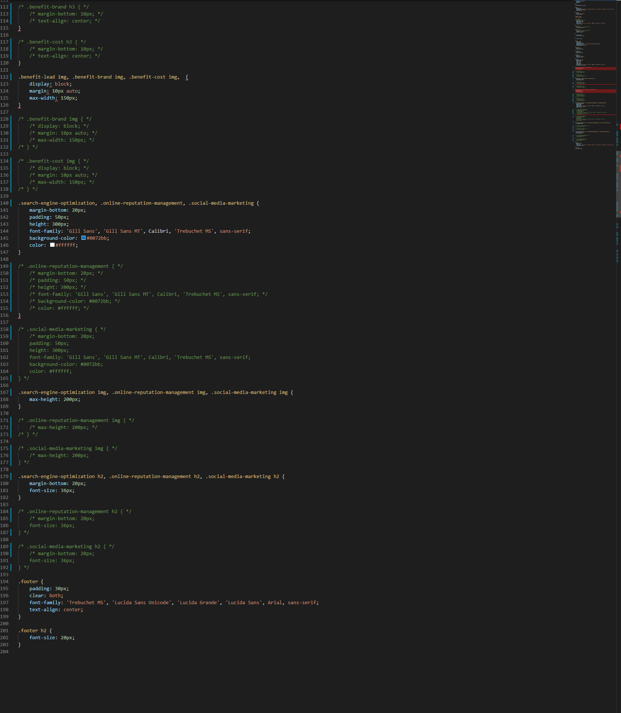

# Code-Refactor-HW

Assignment Description: refactoring an existing webpage. Cleaning up divs, using semantic markups, consolidating css, etc.

link to deployed assignment: https://arielbs1991.github.io/Code-Refactor-HW/